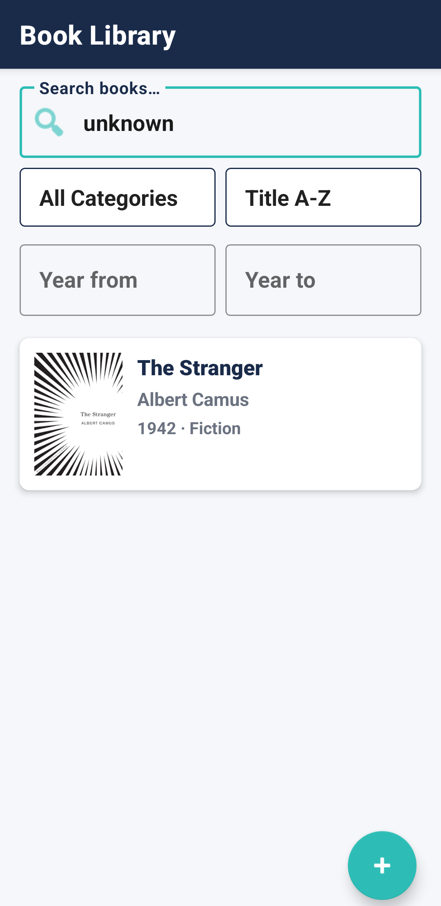
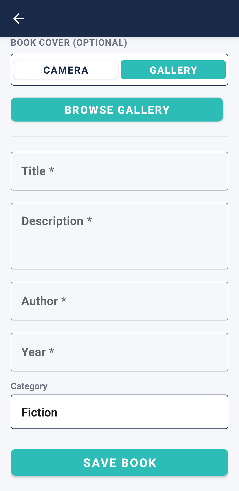
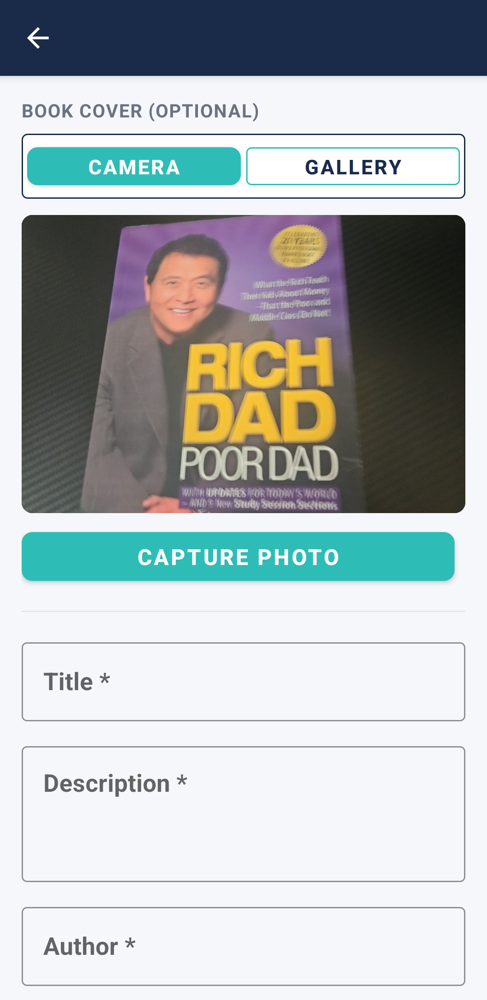
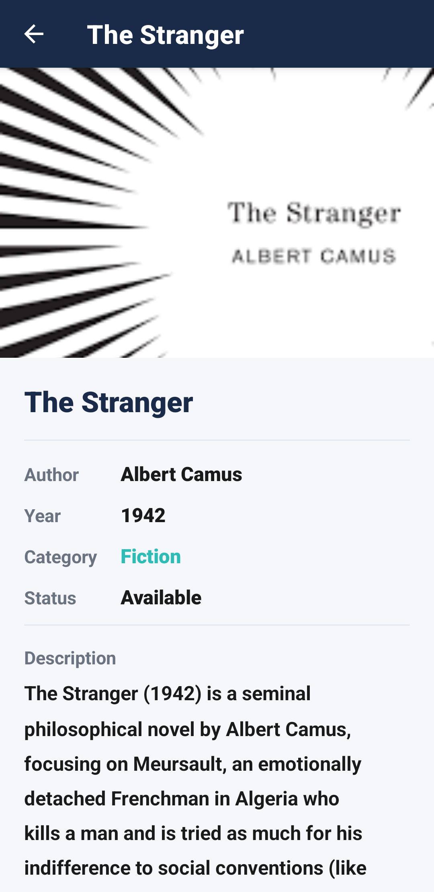
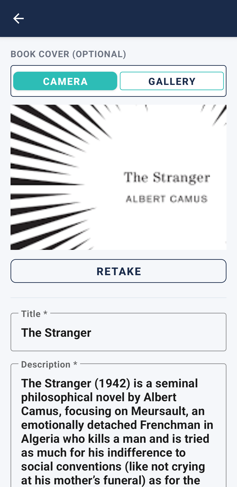
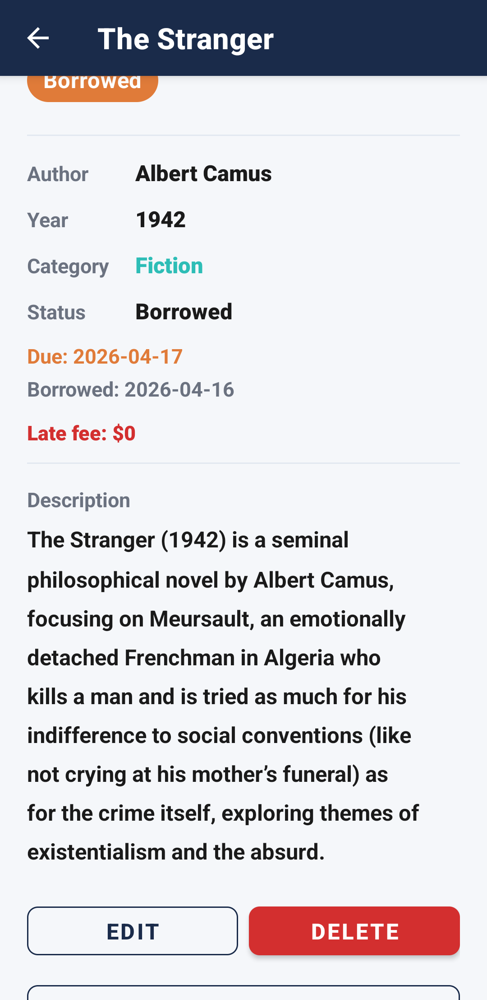

# Book Library — Full Stack Mobile Application

**Student:** Hamza El Rachdi  
**Student ID:** 202502882   
**Course:** CMPS 279 — Mobile Back End, Spring 2025–26  

---

## Demo Video

> **[Watch on YouTube → PLACEHOLDER_YOUTUBE_LINK]**

---

## Screenshots

| Book List | Add Book - No Camera | Add Book - Camera Capture |
|---|---|---|
|  |  |  |

| Book Detail | Edit Book | Borrowed Book |
|---|---|---|
|  |  |  |

---

## Table of Contents

1. [Project Overview](#project-overview)
2. [Architecture](#architecture)
3. [Database Schema](#database-schema)
4. [API Endpoints](#api-endpoints)
5. [Backend — FastAPI](#backend--fastapi)
6. [Android App — MVVM](#android-app--mvvm)
7. [Running Locally](#running-locally)
8. [Deployment (Fly.io)](#deployment-flyio)
9. [Challenges Faced](#challenges-faced)

---

## Project Overview

A complete end-to-end **Book Library** application:

- **Backend:** FastAPI served by Uvicorn, deployed on [Fly.io](https://fly.io) (`cmps-279`, region `cdg`). ⭐ _extra_
- **Database:** MongoDB Atlas — cloud-hosted, accessed via PyMongo.
- **Image storage:** Amazon S3-compatible object storage via **Tigris** (Fly.io add-on). Cover images are uploaded from the Android app as Base64 and stored as public objects. ⭐ _extra_
- **Semantic search:** A locally-run `all-MiniLM-L6-v2` sentence-transformer model produces 384-dimensional embeddings stored per document. Search queries use MongoDB Atlas Vector Search; if the index is unavailable it falls back to regex search across `title`, `author`, `description`, `category`, and a pre-built `search_text` field. ⭐ _extra_
- **Android frontend:** Java MVVM app with four Fragments (List, Add, Detail, Edit), CameraX for in-app photo capture, Glide for image loading, Retrofit 2 + Gson for networking, and the Navigation Component for fragment routing.

### What is required vs. extra

| Feature | Required | Extra / Bonus |
|---|---|---|
| FastAPI CRUD endpoints (`POST`, `GET`, `GET /{id}`, `PUT`, `DELETE`) | ✅ | |
| MongoDB integration (PyMongo, `_id` serialization, Pydantic models) | ✅ | |
| At least 4 fields + 1 unique custom field (`is_borrowed`) | ✅ | |
| Image field (`cover_image`) | ✅ | |
| Filtering / search endpoint (bonus for A grade) | ✅ | |
| Android RecyclerView list screen (data from API) | ✅ | |
| Android Add screen with ≥ 3 inputs + POST | ✅ | |
| Android Detail screen with Update + Delete | ✅ | |
| MVVM architecture + SharedViewModel + LiveData | ✅ | |
| Retrofit 2 + Gson networking | ✅ | |
| Glide image loading | ✅ | |
| CameraX in-app camera (not intent) | ⭐ bonus/ extra | |
| Category + year range filtering | | ⭐ bonus/ extra |
| Cursor-based keyset pagination (infinite scroll) | | ⭐ bonus/ extra |
| Semantic vector search via `all-MiniLM-L6-v2` + Atlas Vector Search | | ⭐ extra |
| Regex search fallback when vector index is unavailable | | ⭐ extra |
| Amazon S3 image storage via Tigris | | ⭐ extra |
| Deployed to Fly.io (live production URL) | | ⭐ extra |
| APK exported and tested on a physical device | | ⭐ extra |
| `uv` package manager instead of conda | | ⭐ modern tooling/ extra |
| Book borrowing workflow with `is_borrowed`, `due_date`, and `borrow_date` fields | | ⭐ unique domain logic/ extra |

---

## Architecture

### Backend

```
backend/
├── main.py
├── routers/
│   └── book.py
├── models/
│   └── book.py
├── services/
│   ├── config.py
│   ├── search.py
│   └── upload.py
├── pyproject.toml
├── requirements.txt
├── fly.toml
└── Dockerfile
```

### Android Frontend

```
frontend/app/src/main/java/lb/edu/aub/cmps279Spring26/hmr23/
├── MainActivity.java
├── ui/
│   ├── BookListFragment.java
│   ├── AddBookFragment.java
│   ├── BookDetailFragment.java
│   └── EditBookFragment.java
├── viewmodels/
│   ├── BookListViewModel.java
│   ├── BookDetailViewModel.java
│   ├── BookFormViewModel.java
│   └── SharedViewModel.java
├── network/
│   ├── BookApi.java
│   └── RetrofitClient.java
├── models/
│   ├── Book.java
│   ├── BookCreate.java
│   ├── BookUpdate.java
│   └── BookListResponse.java
├── adapters/
│   └── BookAdapter.java
└── utils/
    └── ImageUtils.java
```

**Color theme** — deep navy (`#1A2B4A`), teal accent (`#2DBDB6`), warm orange for borrowed status (`#E07B39`), light grey background (`#F5F7FA`).

---

## Database Schema

**Database:** `books_db`  **Collection:** `books`

| Field | Type | Notes |
|---|---|---|
| `_id` | ObjectId | Auto-generated by MongoDB |
| `title` | String | Required |
| `description` | String | Required |
| `author` | String | Required |
| `year` | Integer | Required |
| `category` | String (enum) | Fiction, Non-Fiction, Science, History, Biography, Fantasy, Mystery, Romance |
| `cover_image` | String \| null | Public Tigris/S3 URL; null if no image |
| `is_borrowed` | Boolean | Default: `false` — **unique domain field** |
| `due_date` | Date \| null | ISO date string |
| `borrow_date` | Date \| null | ISO date string |
| `search_text` | String | Concatenated `title + description + author + category`; used for regex fallback |
| `embedding` | Array\<Float\> (384) | `all-MiniLM-L6-v2` vector; used by Atlas Vector Search |
| `created_at` | DateTime (UTC) | Set on insert |
| `updated_at` | DateTime (UTC) | Updated on every PUT |

**Unique custom field:** `is_borrowed` — tracks whether a book has been lent out, enabling borrow/return workflows. The companion fields `due_date` and `borrow_date` support due-date tracking.

**MongoDB Atlas index:**

```json
{
  "name": "vector_index",
  "type": "vectorSearch",
  "fields": [{ "type": "vector", "path": "embedding", "numDimensions": 384, "similarity": "cosine" }]
}
```

---

## API Endpoints

Base URL (production): `https://cmps-279.fly.dev`

| Method | Path | Description | Status |
|---|---|---|---|
| `GET` | `/` | Health check | 200 |
| `POST` | `/books/` | Create a new book | 201 |
| `GET` | `/books/` | List / search / filter / paginate books | 200 |
| `GET` | `/books/{id}` | Get a single book by ID | 200 |
| `PUT` | `/books/{id}` | Update a book (partial update) | 200 |
| `DELETE` | `/books/{id}` | Delete a book | 204 |

### `GET /books/` — Query Parameters

| Parameter | Type | Default | Description |
|---|---|---|---|
| `query` | string | — | Full-text / semantic search query |
| `sorted_by` | `title` \| `author` \| `year` | `title` | Sort field |
| `sort_order` | `asc` \| `desc` | `asc` | Sort direction |
| `category_filter_by` | string | — | Comma or pipe-separated category names (e.g. `Fiction,Science`) |
| `year_from` | int | — | Filter books published from this year |
| `year_to` | int | — | Filter books published up to this year |
| `cursor` | string | — | Opaque Base64 cursor for keyset pagination |
| `limit` | int (1–200) | `20` | Page size |

**Response:**

```json
{
  "books": [ { ...Book } ],
  "next_cursor": "<opaque string or null>"
}
```

### `POST /books/` — Request Body

```json
{
  "title": "Dune",
  "description": "A sci-fi epic on a desert planet.",
  "author": "Frank Herbert",
  "year": 1965,
  "category": "Fiction",
  "cover_image": "data:image/jpeg;base64,/9j/4AAQ..."
}
```

`cover_image` can be a Base64 data URI (uploaded to S3/Tigris and replaced with the public URL) or an `https://` URL (stored as-is), or omitted.

### `PUT /books/{id}` — All fields optional

```json
{
  "is_borrowed": true,
  "due_date": "2026-05-01",
  "borrow_date": "2026-04-16"
}
```

---

## Backend — FastAPI

### Key implementation details

- **`uv`** is used as the primary package manager (`pyproject.toml`). A `requirements.txt` is also provided for conda/pip users (see [Running Locally](#running-locally)).
- **Semantic search** runs entirely in-process: the `all-MiniLM-L6-v2` model is loaded at startup via `sentence-transformers`. Embeddings are created for every document on insert/update and stored in the `embedding` field. Queries hit the MongoDB Atlas `$vectorSearch` stage with a cosine-similarity threshold of **0.55**. If the Atlas vector index is not available (e.g. local dev), the code catches `OperationFailure` and falls back to regex search.
- **Cursor-based pagination** uses an opaque Base64-encoded JSON cursor (sort field, sort order, sort value, last `_id`). This avoids offset-based `skip()` performance issues on large collections.
- **Image upload** accepts a Base64 data URI from the Android app, decodes it, and uploads the raw bytes to a Tigris (S3-compatible) bucket via `boto3`. The returned Tigris public URL is stored on the document.
- **Embedding re-indexing** is handled by `services/search.py:backfill()` — a utility that embeds any documents missing the `embedding` field.

---

## Android App — MVVM

### Navigation Graph

```
BookListFragment  →  AddBookFragment
       ↓
BookDetailFragment  →  EditBookFragment
```

`SharedViewModel` (scoped to the Activity) carries the selected book ID from `BookListFragment` to `BookDetailFragment`.

### Infinite Scroll

`BookListFragment` attaches a `RecyclerView.OnScrollListener`. When `LinearLayoutManager.findLastVisibleItemPosition()` reaches the last visible item, the `BookListViewModel` fires the next paginated `GET /books/` request using the `next_cursor` returned by the API. New results are appended to the existing `LiveData<List<Book>>` and `adapter.notifyItemRangeInserted()` is called.

### CameraX

`AddBookFragment` integrates CameraX (`camera-core`, `camera-camera2`, `camera-lifecycle`, `camera-view`). A `PreviewView` shows the live viewfinder. On capture:
1. `ImageCapture.takePicture()` saves the photo to app-private storage.
2. `ImageUtils.bitmapToBase64()` encodes the bitmap as a Base64 JPEG data URI.
3. The Base64 string is stored on the `BookCreate` model and sent in the `POST /books/` body.
4. The backend decodes and uploads it to Tigris; the stored URL is returned and displayed via Glide.

---

## Running Locally

### Backend

First, create a `.env` file in the `backend/` directory with the following variables:

```
DATABASE_URL=mongodb+srv://<user>:<pass>@cluster.mongodb.net/
AWS_ACCESS_KEY_ID=...
AWS_SECRET_ACCESS_KEY=...
AWS_ENDPOINT_URL_S3=https://fly.storage.tigris.dev
AWS_REGION=auto
BUCKET_NAME=<your-tigris-bucket>
```

#### Option A — uv (recommended, fast)

```bash
cd backend
uv sync
uv run uvicorn main:app --reload
```

#### Option B — conda

```bash
cd backend
conda create -n books-api python=3.12 -y
conda activate books-api
pip install torch --index-url https://download.pytorch.org/whl/cpu
pip install -r requirements.txt
uvicorn main:app --reload
```

> **Note:** `sentence-transformers` will download the `all-MiniLM-L6-v2` model weights (~90 MB) on first startup. Subsequent starts are instant because the weights are cached in `~/.cache/huggingface/`.

### Android

1. Open `frontend/` in Android Studio.
2. Update `RetrofitClient.java` — change `BASE_URL` to `http://10.0.2.2:8000/` for the emulator (or your machine's LAN IP for a physical device).
3. Run on emulator or device (minSdk 24).

---

## Deployment (Fly.io)

The backend is deployed to Fly.io as a Docker container:

```
fly deploy
```

**`fly.toml` highlights:**
- App name: `cmps-279`, region: `cdg` (Paris)
- `min_machines_running = 1` — keeps one machine always warm (no cold-start delay for the TA demo)
- 1 GB RAM, 1 CPU — enough for in-process transformer inference

**Dockerfile highlights (multi-stage build):**

```dockerfile
FROM python:3.12 AS builder
RUN .venv/bin/pip install torch --index-url https://download.pytorch.org/whl/cpu
RUN .venv/bin/pip install . sentence-transformers
RUN .venv/bin/python -c "from sentence_transformers import SentenceTransformer; SentenceTransformer('all-MiniLM-L6-v2')"

FROM python:3.12-slim
COPY --from=builder /app/.venv .venv/
COPY --from=builder /root/.cache /root/.cache
```

Baking the model weights into the image cache means the worker is ready to embed immediately on startup — no network download during cold start.

---

## Challenges Faced

1. **Fly.io deployment and cold starts** — The default Python Docker image was pulling the `all-MiniLM-L6-v2` model weights (~90 MB) from Hugging Face on every cold start, adding 30–60 seconds of latency before the first request could be served. The fix was a two-stage Dockerfile that runs `SentenceTransformer('all-MiniLM-L6-v2')` in the builder stage, which populates `~/.cache/huggingface/` and is then `COPY`-ed into the slim runtime image. Combined with `min_machines_running = 1`, cold starts are effectively eliminated.

2. **Cosine-similarity threshold tuning** — Running a local embedding model in-process trades cost and latency for accuracy. The `all-MiniLM-L6-v2` model is fast but general-purpose; for short book titles and authors the cosine scores vary widely. A threshold that was too low returned irrelevant results; too high missed obvious matches. After manual testing across the book collection the value was set to **0.55**, with regex fallback as a safety net.

3. **uv instead of conda** — The host machine had limited disk space and conda's package solver + base environment were too heavyweight. Migrating to `uv` (Astral) reduced environment setup from several minutes and gigabytes of packages to a sub-second `uv sync`. The trade-off was that `torch` needed an explicit CPU-only index URL (`--index-url https://download.pytorch.org/whl/cpu`) both in the Dockerfile and locally.

4. **Amazon S3 / Tigris integration** — Tigris is an S3-compatible store bundled with Fly.io. Configuring `boto3` to point at the Tigris endpoint (`fly.storage.tigris.dev`) instead of AWS required setting `endpoint_url` explicitly. The Android side sends the captured frame as a Base64 data URI in the JSON body (rather than `multipart/form-data`), which simplified the Retrofit interface but required the backend to decode and re-upload the bytes.

5. **Android frontend wiring** — This was the first time working with the Android side of the stack. Getting CameraX, Navigation Component, View Binding, Data Binding, Retrofit, and Glide all working correctly together in an MVVM pattern — with the right `ViewLifecycleOwner` for `LiveData` observers, nullifying bindings in `onDestroyView()`, and sharing state via `SharedViewModel` — required careful attention to Android lifecycle semantics that are non-obvious coming from a backend background.
